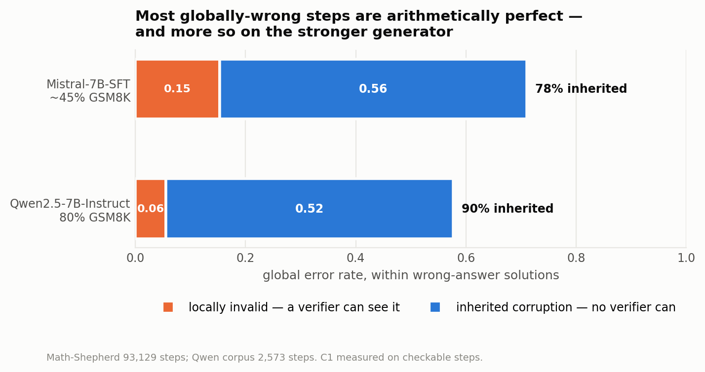

# 4. Measuring the gap

> Reproduce: `python scripts/exp_measure_error_rate.py`,
> `python scripts/exp_generator_transfer.py`

Every propagation result in the original design assumed a local error rate of
0.15. This chapter measures it, on 93,129 real steps, and in doing so measures
the local/global gap that the model only simulated.

## 4.1 Why the numbers must be stratified

Math-Shepherd is a constructed PRM *training* set. It samples multiple
completions per problem and keeps a deliberate mix of good and bad ones, so its
raw `+`/`-` balance is a property of their construction, not of the model's
natural error rate. A blended unconditional number would not mean what it
appears to mean.

Every rate below is therefore reported per stratum — solutions whose final
answer is correct, and solutions whose final answer is wrong — and
post-stratified to the model's reported accuracy, with the sensitivity shown.

## 4.2 The headline measurement

Mistral-7B-SFT, 25,971 solutions, 93,129 steps, marker notation (the
`<<expr=result>>` check, byte-for-byte Math-Shepherd's own):

| stratum | solutions | steps | local err | global err | inherited |
|---|---|---|---|---|---|
| final answer CORRECT | 6,940 | 21,505 | 0.0242 | 0.0000 | 0.0000 |
| final answer WRONG | 19,031 | 71,624 | **0.1641** | **0.7106** | **0.4961** |
| raw sample (biased mix) | 25,971 | 93,129 | 0.1305 | 0.5465 | 0.3816 |

The raw sample's solution-level accuracy is 26.7%, against a reported model
accuracy of 41–52%. That gap is the constructed class mix, and it is why the
raw row must not be quoted.

Post-stratified to Mistral-7B-SFT's reported GSM8K accuracy (~41–52%,
arXiv:2312.08935):

| assumed accuracy | local error | global error |
|---|---|---|
| 40% | 0.1081 | 0.4264 |
| **45%** | **0.1011** | **0.3908** |
| 52% | 0.0913 | 0.3411 |

The local rate is fairly insensitive to the assumed accuracy; the global rate
is not, because global correctness is almost definitional for the two strata.

**The central number.** Within wrong-answer solutions, inherited corruption is
0.4961 of all steps against a global error rate of 0.7106:

```
C1_all = 0.4961 / 0.7106 = 0.6982
```

**69.8% of globally-wrong steps are arithmetically perfect.** Under the
checkable-conditioned estimator on the same data the figure is **0.7848**.

Controlling local selective risk at level α bounds nothing about the answer.

## 4.3 Corruption is close to absorbing

| | Mistral-7B-SFT |
|---|---|
| steps after the first globally-bad step | 71,624 |
| of which still labelled `-` | **95.9%** |
| solutions that fully recovered | **0 of 25,971** |

Of steps that are locally valid and downstream of a local error, essentially
all are globally wrong. That is the propagation signature, measured rather than
assumed: steps that are arithmetically perfect and still wrong because a
premise was.

Zero recoveries in 25,971 solutions is the strongest single piece of evidence
that the local/global gap cannot be closed by more of the same verification.

## 4.4 The gap widens on a stronger generator

The obvious objection to §4.2 is that Mistral-7B-SFT is a weak 2023 model at
~45% on GSM8K, and a better generator would close the gap by itself.

To test it, 500 GSM8K **test** problems were solved by Qwen2.5-7B-Instruct and
labelled by the same procedure: Math-Shepherd's hard estimation, K = 4 rollouts
per step prefix, `+` if any reaches the gold answer. 8,292 rollouts, 7h40m on
two Tesla T4s. The corpus is written in Math-Shepherd's own `label` format so
that `exp_measure_error_rate.py` reads both without modification — the
comparison is between two corpora, not two analysis implementations.

### A notation problem that nearly produced a wrong answer

Math-Shepherd's local check reads GSM8K's `<<expr=result>>` markers.
Mistral-7B-SFT emits them in 87.8% of steps because it was fine-tuned on GSM8K
itself. **Qwen emits them in 14.5%** and writes the rest as LaTeX:

```
\[ \text{Miles Micah ran} = 3.5 \times 8 = 28 \]
Next, we know that Amber and Micah together ran \( 8 + 28 = 36 \) miles.
```

Read with markers only, Qwen's local error rate is **0.0027** — computed on a
biased seventh of its steps, and meaningless. The run's annotation gate caught
it before any number was reported:

```
solve rate       0.8000   band (0.55, 0.95)     PASS
annotation rate  0.1450   floor 0.6             FAIL
```

The solve-rate gate passing is what makes the diagnosis unambiguous: the model
*is* following the prompt and solving the problems at 80%, it simply does not
write GSM8K's notation.

`normalise_notation` rewrites LaTeX and unicode maths as plain arithmetic, and
`local_validity(..., notation="any")` falls back to it when no marker is
present. The check that this **extends** the measurement rather than redefining
it is that it is applied to both corpora and is nearly inert on the baseline:

| corpus | notation | checkable | local error |
|---|---|---|---|
| Mistral-7B-SFT | marker | 88.7% | 0.1305 |
| Mistral-7B-SFT | any | 91.4% | 0.1364 |
| Qwen2.5-7B | marker | 14.5% | 0.0027 |
| Qwen2.5-7B | any | **40.7%** | **0.0315** |

Moving the baseline by 0.6 points while moving the new corpus by an order of
magnitude is the evidence that the extension reads notation rather than
changing what counts as an error. As an implementation check, marker notation
on Math-Shepherd reproduces the published C1 of **0.6982** exactly.

### The result

One definition applied to both corpora, within wrong-answer solutions:

| | Mistral-7B-SFT | Qwen2.5-7B-Instruct |
|---|---|---|
| GSM8K accuracy | ~45% (reported) | **80.0%** (measured here) |
| local error | 0.1708 | **0.0813** |
| global error | 0.7106 | 0.5772 |
| **C1 (checkable)** | **0.7848** | **0.9040** |
| n globally-wrong checkable steps | 46,555 | 125 |
| 95% CI on C1 (Wilson) | [0.781, 0.789] | [0.840, 0.944] |
| 95% CI on C1, resampling solutions | not recomputable | [0.8430, 0.9531] |




**Figure 4.1.** Global error decomposes into the part a verifier can see and the part it cannot. The inherited share rises from 78% to 90% on the stronger generator.

Both published intervals are Wilson intervals, which assume every step is an
independent draw, and the steps are nested in solutions. On the Qwen side that
correction has now been made — resampling solutions gives [0.8430, 0.9531], only
5% wider, because a wrong-answer solution contributes about two globally-wrong
checkable steps and there is almost nothing for the within-solution correlation
to act on (ρ = 0.68, mean cluster 1.98, design effect 1.13). The Mistral side
cannot be recomputed here without re-downloading Math-Shepherd, so it is bounded
instead: for the two intervals to touch, Math-Shepherd's design effect would have
to be **243**, which at this ρ means 356 globally-wrong checkable steps per
solution against an overall mean near 3.6. No correction for clustering can make
them overlap.

The intervals do not overlap. **The gap does not close on a stronger
generator — it widens.**

The mechanism is straightforward once stated: the stronger model halves its
arithmetic slips (0.171 → 0.081) without halving its inherited corruption, so a
larger share of what remains is the kind no calculator can see.

> A deterministic verifier becomes *less* useful as the generator improves.

That is a sharper claim than the thesis originally made, and it is the opposite
of what the objection predicted.

### Why the published estimator could not travel

| estimator | definition | Mistral | Qwen |
|---|---|---|---|
| `C1_all` | inherited / global over **all** steps | 0.7178 | **0.2539** |
| `C1_checkable` | among globally-wrong **checkable** steps | 0.7848 | **0.9040** |

`C1_all` is what produced the 69.8% figure. On Qwen, where 73% of wrong-answer
steps have no arithmetic at all, it collapses to 0.25 and says nothing about
reasoning. The two agree closely when coverage is high, which is why the
distinction never surfaced before. `C1_checkable` is the estimator to quote
across generators.

## 4.5 What does not transfer

Two claims turn out to be properties of the generator that were stated as
properties of the task, and are now labelled per-generator.

**Base risk, and therefore the feasibility floor.**

| | Mistral-7B-SFT | Qwen2.5-7B |
|---|---|---|
| μ (solution-weighted) | 0.3908 | **0.1221** |
| Kotte floor at α = 0.05 | 35.9% | 7.6% |
| at α = 0.10 | 32.3% | 2.5% |
| at α = 0.20 | 23.8% | **none** |

The impossibility bound has not weakened; the base risk it applies to has. On a
strong generator, α = 0.20 is attainable with no entry fee at all. Any
statement about attainable α must name its model. (Chapter 8 develops this.)

**Absorption.**

| | Mistral | Qwen |
|---|---|---|
| steps after the first bad step still bad | 95.9% | 66.4% |
| solutions that fully recovered | 0 / 25,971 | 6 / 500 |

Still strongly absorbing. But "near-absorbing" was measured on Mistral and does
not transfer unqualified; recovery is rare rather than unobserved.

**The position gradient does replicate.** corr(position, local error) = +0.950
on Mistral, **+0.866** on Qwen. Same sign, same conclusion, and it is the
finding Chapter 6 needs.

## 4.6 Limits

- **n = 125.** Qwen's globally-wrong checkable steps, against Mistral's 46,555.
  The Wilson interval excludes the Mistral value but C1 is not precisely
  located.
- **59% of Qwen's steps contain no arithmetic.** They are narration — *"First,
  we determine how many miles Micah ran."* C1 is computed on the checkable 41%,
  and if narration steps carry corruption at a different rate the estimate is
  biased. This is not fixable by better extraction; those steps assert nothing
  a calculator could check.
- **A "step" is not model-invariant.** Qwen writes 5.15 steps per solution
  against Mistral's ~3.6, and most of Qwen's are prose. Math-Shepherd's step is
  one calculator operation; Qwen's is one line of explanation. Per-step rates
  across models are rates over different units, and this belongs in the
  limitations chapter as a property of the unit of analysis rather than of the
  measurement.
- **Label semantics.** Math-Shepherd's `+`/`-` are automatic Monte-Carlo
  estimates of "leads to a correct answer", not proofs. A lucky wrong step can
  be labelled `+`, which makes the measured global error rate a lower bound.
- **The generator is not the one the thesis names.** Llama 3.1 8B is
  licence-gated on Kaggle; the API returns *"User has not consented to terms of
  use"* and the model is silently not mounted, so two sessions ended at setup.
  Qwen2.5-7B-Instruct is the same size class with comparable GSM8K accuracy,
  which is the property the argument needs. Re-running on Llama requires no
  code change.
