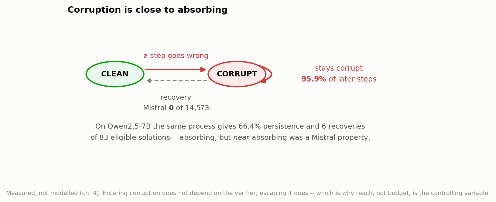
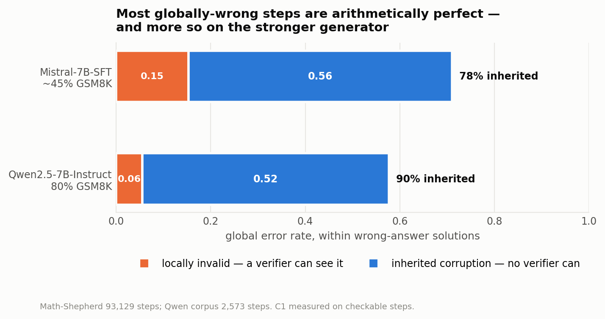

# 4. Measuring the gap

> Reproduce: `python scripts/exp_measure_error_rate.py`,
> `python scripts/exp_generator_transfer.py`

Every propagation result in the original design assumed a local error rate of
0.15. This chapter measures it, on 93,129 real steps, and in doing so measures
the local/global gap that the model only simulated.

## 4.1 Why the numbers must be stratified

Math-Shepherd is a constructed PRM *training* set. It samples multiple
completions per problem and keeps a deliberate mix of good and bad ones, so its
raw `+`/`-` balance is a property of their construction, not of the model's
natural error rate. A blended unconditional number would not mean what it
appears to mean.

Every rate below is therefore reported per stratum — solutions whose final
answer is correct, and solutions whose final answer is wrong — and
post-stratified to the model's reported accuracy, with the sensitivity shown.

## 4.2 The headline measurement

Mistral-7B-SFT, 25,971 solutions, 93,129 steps, marker notation (the
`<<expr=result>>` check, byte-for-byte Math-Shepherd's own):

| stratum | solutions | steps | local err | global err | inherited |
|---|---|---|---|---|---|
| final answer CORRECT | 6,940 | 21,505 | 0.0242 | 0.0000 | 0.0000 |
| final answer WRONG | 19,031 | 71,624 | **0.1641** | **0.7106** | **0.4961** |
| raw sample (biased mix) | 25,971 | 93,129 | 0.1305 | 0.5465 | 0.3816 |

The raw sample's solution-level accuracy is 26.7%, against a reported model
accuracy of 41–52%. That gap is the constructed class mix, and it is why the
raw row must not be quoted.

Post-stratified to Mistral-7B-SFT's reported GSM8K accuracy (~41–52%,
arXiv:2312.08935):

| assumed accuracy | local error | global error |
|---|---|---|
| 40% | 0.1081 | 0.4264 |
| **45%** | **0.1011** | **0.3908** |
| 52% | 0.0913 | 0.3411 |

The local rate is fairly insensitive to the assumed accuracy; the global rate
is not, because global correctness is almost definitional for the two strata.

**The central number.** Within wrong-answer solutions, inherited corruption is
0.4961 of all steps against a global error rate of 0.7106:

```
C1_all = 0.4961 / 0.7106 = 0.6982
```

**69.8% of globally-wrong steps are arithmetically perfect** by this
estimator (`C1_all`). §4.4 shows it is the wrong one to carry across
generators and replaces it with `C1_checkable` = **78.5%**, which is the figure
quoted elsewhere. Under the
checkable-conditioned estimator on the same data the figure is **0.7848**.

Controlling local selective risk at level α bounds nothing about the answer.

## 4.3 Corruption is close to absorbing



**Figure 4.1.** The process the persistence and recovery numbers describe.
Entering corruption does not depend on the verifier; escaping it does — which
is why Chapter 5 treats reach rather than budget as the controlling variable.

| | Mistral-7B-SFT |
|---|---|
| steps after the first globally-bad step | 33,236 |
| of which still labelled `-` | **95.9%** |
| solutions able to recover (a first bad step, then more steps) | 14,573 |
| solutions that fully recovered | **0 of 14,573** |

"Fully recovered" means every step after the first globally-bad one is good —
not merely that some later step is. Under the weaker reading 1,062 solutions
contain a good step downstream of corruption, which is why the strict
definition is the one stated.

Of steps that are locally valid and downstream of a local error, **89.6%** are
globally wrong. That is the propagation signature, measured rather than
assumed: steps that are arithmetically perfect and still wrong because a
premise was. (The 95.9% above is a different population — all steps after the
first globally-bad step, not only the locally-valid ones.)

Zero recoveries in the 14,573 solutions that could have recovered is the
strongest single piece of evidence
that the local/global gap cannot be closed by more of the same verification.

## 4.4 The gap widens on a stronger generator

The obvious objection to §4.2 is that Mistral-7B-SFT is a weak 2023 model at
~45% on GSM8K, and a better generator would close the gap by itself.

To test it, 500 GSM8K **test** problems were solved by Qwen2.5-7B-Instruct and
labelled by the same procedure: Math-Shepherd's hard estimation, K = 4 rollouts
per step prefix, `+` if any reaches the gold answer. 8,292 rollouts, 7h40m on
two Tesla T4s. The corpus is written in Math-Shepherd's own `label` format so
that `exp_measure_error_rate.py` reads both without modification — the
comparison is between corpora, not between analysis implementations.

### A notation problem that nearly produced a wrong answer

Math-Shepherd's local check reads GSM8K's `<<expr=result>>` markers.
Mistral-7B-SFT emits them in 88.7% of steps because it was fine-tuned on GSM8K
itself. **Qwen emits them in 14.5%** and writes the rest as LaTeX:

```
\[ \text{Miles Micah ran} = 3.5 \times 8 = 28 \]
Next, we know that Amber and Micah together ran \( 8 + 28 = 36 \) miles.
```

Read with markers only, Qwen's local error rate is **0.0027** — computed on a
biased seventh of its steps, and meaningless. The run's annotation gate caught
it before any number was reported:

```
solve rate       0.8000   band (0.55, 0.95)     PASS
annotation rate  0.1450   floor 0.6             FAIL
```

The solve-rate gate passing is what makes the diagnosis unambiguous: the model
*is* following the prompt and solving the problems at 80%, it simply does not
write GSM8K's notation.

`normalise_notation` rewrites LaTeX and unicode maths as plain arithmetic, and
`local_validity(..., notation="any")` falls back to it when no marker is
present. The check that this **extends** the measurement rather than redefining
it is that it is applied to every corpus and is nearly inert on the baseline:

| corpus | notation | checkable | local error |
|---|---|---|---|
| Mistral-7B-SFT | marker | 88.7% | 0.1305 |
| Mistral-7B-SFT | any | 91.4% | 0.1364 |
| Qwen2.5-7B | marker | 14.5% | 0.0027 |
| Qwen2.5-7B | any | **40.7%** | **0.0315** |
| Llama 3.1 8B | marker | 30.9% | 0.0117 |
| Llama 3.1 8B | any | **64.3%** | **0.0401** |

Llama, added later, fails the same gate for the same reason and is rescued the
same way: the annotation rate is 0.3101 against the 0.60 floor, and the
fallback lifts checkability from 30.9% to 64.3%. It sits between the two
earlier corpora on this axis as well.

Moving the baseline by 0.6 points while moving the new corpus by an order of
magnitude is the evidence that the extension reads notation rather than
changing what counts as an error. As an implementation check, marker notation
on Math-Shepherd reproduces the published C1 of **0.6982** exactly.

### The result

A third generator was added after the first draft of this chapter.
Llama 3.1 8B Instruct is licence-gated on Kaggle, which is why §4.6 originally
recorded it as named but unrunnable; once the licence was accepted the same
harness ran unmodified. 500 GSM8K test problems, K = 4 rollouts, temperature
0.7, 4-shot — identical settings to the Qwen run — 5,752 rollouts, 6h11m on two
Tesla T4s, and the written corpus round-trips 500/500 through the Math-Shepherd
parser. It holds 1,938 steps across 500 solutions, 3.88 per solution, against
Qwen's 2,573 at 5.15.

One definition applied to all three corpora, within wrong-answer solutions,
ordered by generator accuracy:

| | Mistral-7B-SFT | Llama 3.1 8B | Qwen2.5-7B-Instruct |
|---|---|---|---|
| GSM8K accuracy | ~45% (reported) | **68.4%** (measured here) | **80.0%** (measured here) |
| local error | 0.1708 | 0.1034 | **0.0813** |
| global error | 0.7106 | 0.7442 | 0.5772 |
| **C1 (checkable)** | **0.7848** | **0.8738** | **0.9040** |
| n globally-wrong checkable steps | 46,555 | 309 | 125 |
| 95% CI on C1 (Wilson) | [0.781, 0.789] | [0.832, 0.906] | [0.840, 0.944] |

**C1 is monotone in generator accuracy across all three.** 0.7848 at 45%,
0.8738 at 68.4%, 0.9040 at 80%. The third point was not fitted: §4.4 was
written with two generators and predicted that a model between them would fall
between them, and Llama does. Its interval excludes Mistral's value and
overlaps Qwen's, which is what a monotone relationship measured on 309 and 125
steps should look like.

Local error is monotone on the same ordering — 0.1708, 0.1034, 0.0813 — and
that is the mechanism. Global error is **not** monotone (0.7106, 0.7442,
0.5772); Llama's wrong-answer solutions are the most globally corrupted of the
three. So the rise in C1 is not driven by the numerator growing. It is driven
by the denominator of arithmetic slips shrinking faster than inherited
corruption does.




**Figure 4.2.** Global error decomposes into the part a verifier can see and the part it cannot. The inherited share rises from 78% to 90% on the stronger generator.

The intervals do not overlap. **The gap does not close on a stronger
generator — it widens.**

The mechanism is straightforward once stated: the stronger model halves its
arithmetic slips (0.171 → 0.081) without halving its inherited corruption, so a
larger share of what remains is the kind no calculator can see.

> A deterministic verifier becomes *less* useful as the generator improves.

That is a sharper claim than the thesis originally made, and it is the opposite
of what the objection predicted.

### Why the published estimator could not travel

| estimator | definition | Mistral | Qwen |
|---|---|---|---|
| `C1_all` | inherited / global over **all** steps | 0.7178 | **0.2539** |
| `C1_checkable` | among globally-wrong **checkable** steps | 0.7848 | **0.9040** |

`C1_all` is what produced the 69.8% figure. On Qwen, where 73% of wrong-answer
steps have no arithmetic at all, it collapses to 0.25 and says nothing about
reasoning. The two agree closely when coverage is high, which is why the
distinction never surfaced before. `C1_checkable` is the estimator to quote
across generators.

## 4.5 What is generator-dependent, and how

Three quantities were stated as properties of the task and are properties of
the generator. With two models that was all that could be said. With three it
is possible to say something stronger: they are not idiosyncratic, they move
monotonically with generator accuracy.

**Base risk, and therefore the feasibility floor.** μ is solution-weighted —
each stratum weighted by its share of solutions, not of steps — because wrong
solutions are systematically longer and step-weighting would over-count them.
On Llama the step-weighted rate is 0.2714 against a solution-weighted 0.2428,
and the latter is the one comparable to the other two rows.

| | Mistral-7B-SFT | Llama 3.1 8B | Qwen2.5-7B |
|---|---|---|---|
| GSM8K accuracy | ~45% | 68.4% | 80.0% |
| μ (solution-weighted) | 0.3908 | 0.2428 | **0.1221** |
| Kotte floor at α = 0.05 | 35.9% | 20.3% | 7.6% |
| at α = 0.10 | 32.3% | 15.9% | 2.5% |
| at α = 0.20 | 23.9% | 5.4% | **none** |

The impossibility bound has not weakened; the base risk it applies to has, and
it does so smoothly. Any statement about attainable α must name its model.
(Chapter 8 develops this.)

**Absorption.**

| | Mistral | Llama | Qwen |
|---|---|---|---|
| steps after the first bad step still bad | 95.9% | 81.6% | 66.4% |
| solutions able to recover | 14,573 | 141 | 83 |
| solutions that fully recovered | 0 / 14,573 (0.0%) | 12 / 141 (8.5%) | 6 / 83 (7.2%) |

Persistence is monotone in accuracy: 95.9%, 81.6%, 66.4%. The recovery *rate*
is not strictly — Llama's 8.5% sits marginally above Qwen's 7.2% — but on 141
and 83 eligible solutions that ordering is well inside sampling noise and
nothing should be read into it. What the three points do establish is that
**"near-absorbing" is not a Mistral quirk; it is what corruption looks like in
a weak generator, and it decays as the generator improves.** An earlier draft
of this section could only say the property failed to transfer.

**The position gradient's sign replicates everywhere; its magnitude is
resolvable on two corpora of three.** corr(position, local error) = +0.950 on
Mistral, resolved over eight bins and tens of thousands of steps. On Llama it
is **+0.876**, over four bins holding at least 60 checkable steps. On Qwen it
is **+0.26** under marker notation and **+0.36** under `notation="any"`, over
four and six bins holding at least 30.

Qwen writes too little checkable arithmetic to establish a gradient: 59% of its
steps assert none, and the deepest bin with 30 usable steps is step 5. Llama
carries 64.3% checkable steps against Qwen's 40.7%, which is why it resolves a
gradient where Qwen cannot. Chapter 6's allocation conclusion rested on the
Mistral measurement alone for exactly that reason, and now has an independent
confirmation on a generated corpus.

An earlier draft reported **+0.866** for Qwen. That figure comes from three
bins whose local-error rates are 0.0000, 0.0000 and 0.0133 — √3/2 is the exact
Pearson r of that pattern — under the marker extractor this chapter itself
calls unusable on Qwen (§4.4: it reports 0.0027, "which is nonsense"). It was
an artifact of the bin count, not a replication. Its numerical closeness to
Llama's genuine +0.876 is a coincidence and should not be read as
corroboration.

## 4.6 Limits

- **n = 309 and n = 125.** Llama's and Qwen's globally-wrong checkable steps,
  against Mistral's 46,555. Both Wilson intervals exclude the Mistral value, so
  the monotone ordering is not an artifact of sample size — but neither C1 is
  precisely located, and the two generated corpora's intervals overlap each
  other heavily.
- **Both generated corpora are thin on checkable arithmetic.** 59.3% of Qwen's
  steps and 35.7% of Llama's assert none; they are narration — *"First, we
  determine how many miles Micah ran."* C1 is computed on the checkable
  fraction (40.7% and 64.3% respectively), and if narration steps carry
  corruption at a different rate the estimate is biased. Not fixable by better
  extraction; those steps assert nothing a calculator could check.
- **Llama failed the annotation gate.** It writes `<<expr=result>>` markers on
  only 31.0% of steps against the 0.60 floor, so the run continued in
  non-strict mode. The `notation="any"` fallback is what makes the corpus
  usable at all, lifting checkability from 30.9% to 64.3%. Every Llama figure
  here therefore depends on that extension being sound, which §4.4 argues from
  its near-inertness on the baseline rather than assuming.
- **Llama's propagation signature is not measurable.** Only 1.2% of its
  solutions contain any arithmetic error, which leaves **4** locally-valid
  steps downstream of a local error. The 75.0% figure the harness prints for
  them is three steps out of four and is not quoted anywhere in this chapter.
  Mistral's corresponding 89.6% rests on tens of thousands.
- **A "step" is not model-invariant.** Qwen writes 5.15 steps per solution and
  Llama 3.88, against Mistral's ~3.6, and most of Qwen's are prose.
  Math-Shepherd's step is one calculator operation; Qwen's is one line of
  explanation. Per-step rates across models are rates over different units, and
  this belongs in the limitations chapter as a property of the unit of analysis
  rather than of the measurement.
- **Label semantics.** Math-Shepherd's `+`/`-` are automatic Monte-Carlo
  estimates of "leads to a correct answer", not proofs. A lucky wrong step can
  be labelled `+`, which makes the measured global error rate a lower bound.
- **Three points, one family.** All three generators are 7–8B instruction-tuned
  models evaluated on GSM8K. The monotone relationship in §4.5 is measured
  across a narrow band of the design space, and nothing here establishes that
  it continues to a 70B model or to a different task.
