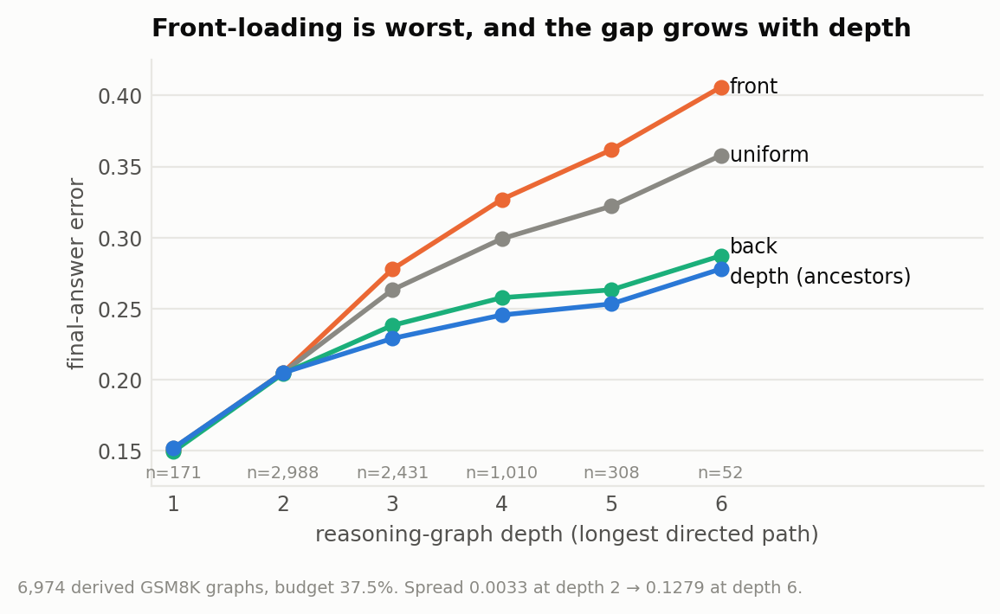
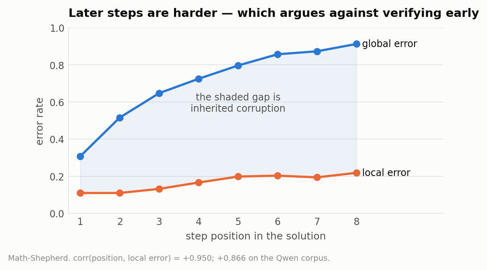

# 6. Allocation

> Reproduce: `python scripts/exp_allocation.py`, `python scripts/exp_topology.py`,
> `python scripts/validate_dependency_graphs.py score`

Given a verification budget and a chain of steps, where should the calls go?
The intuition in the original specification was hypothesis H3: verify early,
because an error caught at step 1 costs one call while the same error caught at
step 5 has already contaminated four downstream conclusions.

The intuition about *cost* is correct. The inference about *allocation* is
false, and it took five separate tests to establish that, two of which were
confounded and had to be discarded.

## 6.1 "Verify early" is false

Front-loading is the worst allocation shape at every verifier scope above zero.
This was tested on:

1. **Linear chains** under the propagation model.
2. **Five synthetic DAG families** — chain, tree, converging, diamond, wide.
3. **Real StrategyQA graphs** — all 2,272 annotated decompositions.
4. **Real GSM8K graphs** — 6,974 derived from calculator annotations.
5. **The corrected GSM8K graphs**, after the extraction bug in §6.3.

Final-answer error by allocation policy (lower is better), on real extracted
graphs at matched budget:

| policy | StrategyQA | GSM8K (corrected) |
|---|---|---|
| uniform | 0.2418 | 0.2447 |
| front | 0.2460 | 0.2556 |
| back | 0.2353 | 0.2264 |
| influence (descendant count) | 0.2461 | 0.2530 |
| **depth (ancestor count)** | **0.2335** | **0.2219** |
| cut (bottleneck weight) | 0.2384 | 0.2318 |
| *spread, max − min* | *0.0126* | *0.0338* |
| *best* | *depth* | *depth* |

`front` and `influence` are the two worst policies on both benchmarks.

The spread is small in aggregate because most graphs are shallow, and the
choice of policy only matters where there is depth for corruption to propagate
through. Broken out by GSM8K graph depth:

| depth | graphs | uniform | front | back | influence | depth | cut | spread |
|---|---|---|---|---|---|---|---|---|
| 1 | 171 | 0.1518 | 0.1503 | 0.1495 | 0.1518 | 0.1518 | 0.1518 | 0.0023 |
| 2 | 2,988 | 0.2049 | 0.2049 | 0.2042 | 0.2033 | 0.2048 | 0.2016 | 0.0033 |
| 3 | 2,431 | 0.2632 | 0.2777 | 0.2382 | 0.2744 | **0.2290** | 0.2423 | 0.0488 |
| 4 | 1,010 | 0.2992 | 0.3269 | 0.2577 | 0.3241 | **0.2455** | 0.2746 | 0.0814 |
| 5 | 308 | 0.3221 | 0.3618 | 0.2632 | 0.3600 | **0.2533** | 0.2983 | 0.1084 |
| 6 | 52 | 0.3578 | 0.4059 | 0.2872 | 0.4013 | **0.2779** | 0.3373 | **0.1279** |

The spread grows monotonically with depth, from 0.0033 to **0.1279**, and
`front` and `influence` diverge from the field in exactly the regime the thesis
is about. At depth 6, front-loading costs 12.8 points of final accuracy against
ancestor-count allocation.

This is also why the aggregate comparison on StrategyQA is uninformative:
Chapter 8 shows 72.9% of its graphs are one hop deep, which is the regime where
every policy is within 0.003 of every other.




**Figure 6.1.** Allocation policies by reasoning-graph depth. The choice is irrelevant on shallow graphs and worth 12.8 points at depth 6.

### Why the intuition misleads

Front-loading is optimal only if early steps are where the errors are. The
propagation model has entering corruption depend on the local error rate and
*not* on the verifier's reach, so under an i.i.d. error assumption every step
is equally likely to originate corruption, and the expected damage from
verifying step `t` is dominated by how much *already-corrupted* state it can
repair — which grows with `t`.

The last defence was that early steps might be intrinsically harder, which
would restore the case for front-loading. **Measurement closes it.**

| position | checkable steps | local error | global error |
|---|---|---|---|
| 1 | 23,444 | 0.1095 | 0.3077 |
| 2 | 23,480 | 0.1098 | 0.5159 |
| 3 | 17,229 | 0.1319 | 0.6475 |
| 4 | 9,773 | 0.1662 | 0.7250 |
| 5 | 4,845 | 0.1981 | 0.7963 |
| 6 | 2,186 | 0.2031 | 0.8569 |
| 7 | 990 | 0.1939 | 0.8730 |
| 8 | 417 | **0.2182** | 0.9124 |




**Figure 6.2.** Local and global error by step position. Later steps are harder, and the widening gap between the curves is inherited corruption accumulating.

`corr(position, local error rate) = +0.950` on Math-Shepherd, and **+0.866** on
the independently generated Qwen corpus. The local error rate **doubles** from
step 1 to step 8. Later steps are *harder*, not easier, which favours
back-loading further than the model already did.

The global column is a second reading of the same table: it climbs from 0.31 to
0.91, and the widening gap between the two columns across positions is
inherited corruption accumulating — the local rate roughly doubles while the
global rate triples.

## 6.2 Influence weighting is dead, and the first test could not have shown it

The surviving method claim from the literature review was
`verification_value = P(wrong) × downstream_influence`, weighting each step by
its descendant count.

The first test ran on **linear chains**, and on a chain the descendant count of
step `t` is exactly `T − t`, so the influence schedule is a monotone decreasing
function of position — which is to say, `influence_schedule == front_schedule`
with correlation −1.000. The test could not distinguish the two hypotheses. It
was rejecting front-loading and reporting it as a rejection of influence
weighting.

This was caught by a direct challenge to test tree topologies before dropping
the claim, and it is the single most useful methodological correction in the
project. Re-run on branching structures, influence weighting *is*
distinguishable from front-loading, is better than it, and still loses to plain
uniform.

Two further instrumentation artifacts were found and fixed in the same pass:

- **A terminal-node oracle.** Ancestor-weighted schedules put probability 1.0
  on the terminal step, which is trivially the last thing verified, scoring
  exactly 0.0000. The terminal is now excluded.
- **An optimiser that could not move.** Coordinate descent under a tight sum
  constraint cannot change any single coordinate without violating it. Replaced
  with pairwise exchange.

The replacement finding is that the useful structural signal is **ancestor
count**, not descendant count: verify where the most upstream reasoning
converges, not where the most downstream damage could occur. That is the
opposite of the proposed rule, and it is stable across both benchmarks.

## 6.3 Hand-validating the derived dependency graphs

Every GSM8K dependency edge in this thesis is **derived**, not annotated: line
`i` is linked to line `j` when an operand of `i` equals the result of `j`. That
derivation sits underneath every GSM8K topology and allocation number, and it
had never been checked against the source text.

50 graphs were adjudicated, stratified 25/25 by whether the graph contains an
ambiguous link — a link whose operand also appears as a number in the question
and could equally be a restated given. Ambiguity is concentrated (only 11.6% of
graphs contain one), so a uniform sample of 50 would contain about five of the
cases actually at risk.

### The audit found a bug, and not the one it was looking for

The first adjudication packet exposed a systematic **recall** failure:

```
gsm8k_424
  L1: 10*9/10 = 9      [10<-given, 9<-given, 10<-given]
  L2: 10-9 = 1         [10<-given, -9<-?]      <- L1 produced 9. Edge (1,2) LOST.
  L5: 1000-250 = 750   [1000<-L3, -250<-?]     <- L4 produced 250. Edge (4,5) LOST.
```

The operand regex was `-?\d+(?:\.\d+)?`. The optional sign **absorbed the
subtraction operator**, so `"110-80"` produced `[110, −80]`; −80 matched no
earlier result, and the dependency vanished. **Every subtraction in the corpus
silently lost its edge.** A second fault in the same regex dropped leading
dots, turning `.8` into `8`.

Fixed by parsing expressions with `ast` and collecting numeric literals, so an
operator character can never be absorbed into an operand.

### Corpus effect

| metric | before | after |
|---|---|---|
| operand link rate | 30.7% | **35.4%** |
| orphan steps (no parents) | 27.7% | **19.7%** |
| mean longest path | 2.54 | **2.79** |
| steps with a non-terminal descendant | 26.6% | **29.9%** |
| graphs at depth ≥ 3 | 3,030 | **3,815** |
| shape classified `other` | 22.9% | **5.9%** |

The collapse of the `other` category is the strongest evidence the fix is
right: those graphs were *fragmented* into unclassifiable pieces by the missing
edges, and they resolve into ordinary chains and converging structures once the
edges return. Every measure moves in the direction that strengthens the
benchmark switch of Chapter 8.

### One published conclusion overturned

An earlier version of this work reported that the best structural allocation
signal is benchmark-dependent — `depth` on StrategyQA, `cut` on GSM8K. That was
an artifact of the missing edges. With corrected graphs, **`depth` wins on
both**, and the "select the signal on dev data" hedge is unnecessary. The
finding became simpler, not more complicated.

### The measured edge error rate

| stratum | graphs | edges | spurious | missing | edge error | graph error |
|---|---|---|---|---|---|---|
| ambiguous | 25 | 91 | 12 | 3 | **0.1648** | **0.4800** |
| clean | 25 | 48 | 2 | 0 | 0.0417 | 0.0400 |

Stratified to corpus weights (11.6% of graphs contain an ambiguous link):

> **corpus edge error rate 5.6%**, corpus graph error rate 9.1%

Roughly 1 edge in 18 is wrong, and about 1 graph in 11 contains at least one
bad edge.

The dominant failure is **value collision** — an operand that coincidentally
equals an earlier result while actually being a given. `gsm8k_7096`'s `3` is
*3 coupons*, not L1's *$3 discount*; `gsm8k_5124`'s `400` is *gallons per
acre*, not *gallons per day*. Distinguishing these requires reading the
sentence, not the arithmetic, so the residual 5.6% is not fixable by better
matching.

The ambiguity flag turns out to be a poor proxy in **both** directions. Most
flagged links are correct (91 edges, 15 wrong), and `gsm8k_5251` was classified
*clean* yet produced two spurious edges — its colliding value `2` is a
"half → double" factor that never appears as a number in the question. The
honest caveat is therefore *"5.6% of derived edges are wrong,"* measured,
rather than *"9.6% of links are ambiguous,"* which over-counts one way and
under-counts the other.

## 6.4 Two methodological notes

**Adjudication was by LLM, not by blind human annotation.** The derived edges
were visible during adjudication, so this measures *agreement with a careful
reader* rather than independent reconstruction. For tracing which quantity an
operand refers to that judgement is close to mechanical, but it is weaker
evidence than blind double-annotation and is labelled as such.

**5.6% is a lower bound.** Only edges *between annotated calculator steps* are
in scope. Solutions routinely contain unannotated reasoning lines
(`gsm8k_4767`: `"$100 - $60 = $40"` has no `<<>>`), and a dependency routed
through one is invisible to any operand-matching scheme.

## 6.5 The general lesson

The audit was queued to quantify a known caveat — the 9.6% ambiguous-link rate.
It instead found a bug an order of magnitude more consequential, one that had
been silently corrupting every GSM8K structural number in the project.

> The caveat you set out to quantify is rarely the one that matters. Auditing a
> derivation is worth more than characterising its known limitation.
