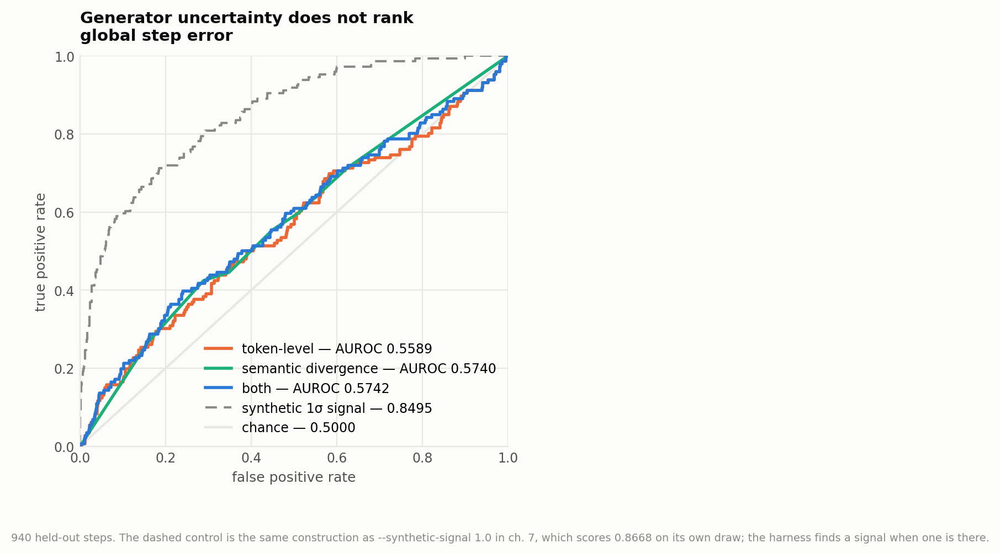
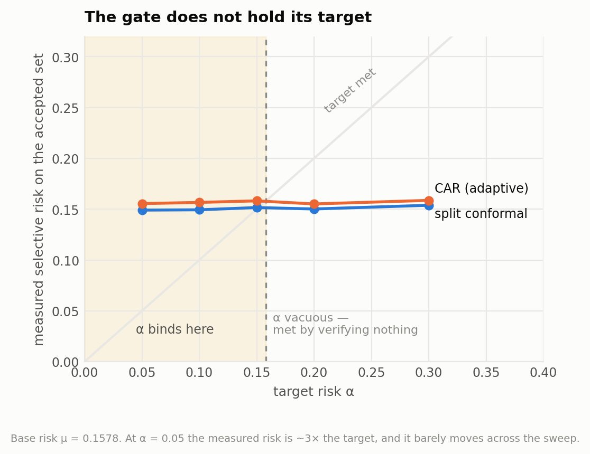
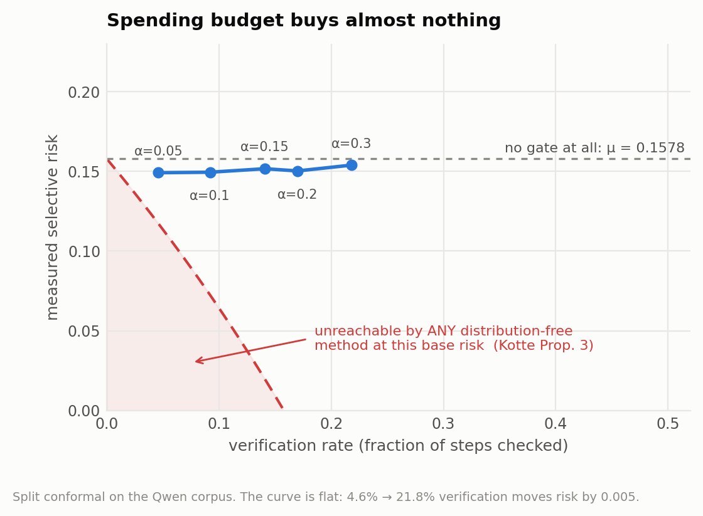
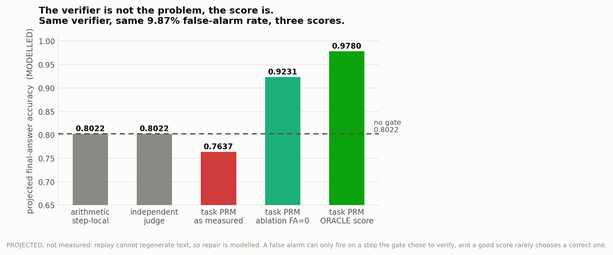
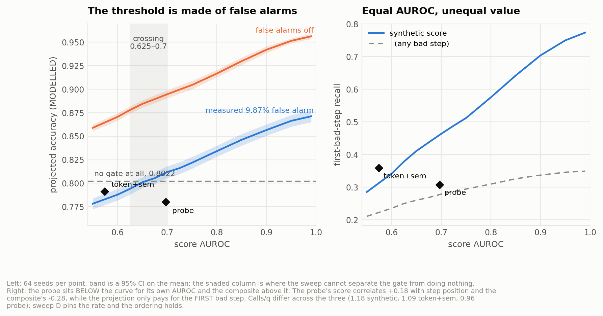
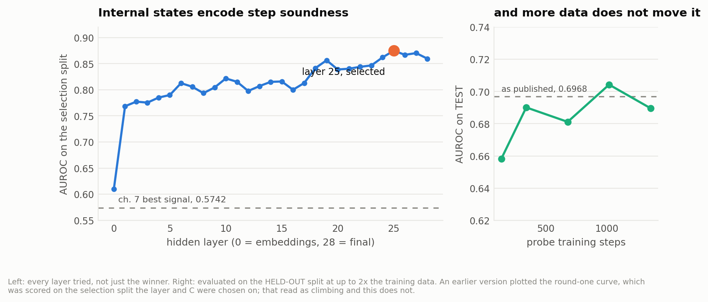
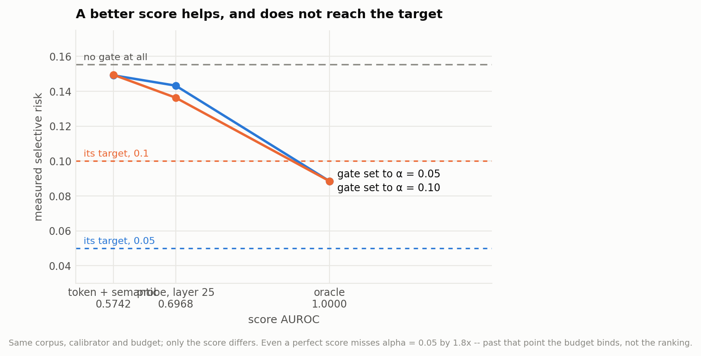
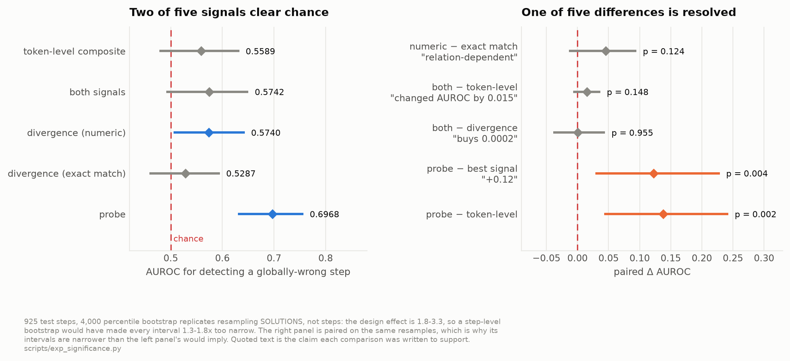

# 7. The assembled gate

> Reproduce: `python scripts/exp_gate_pipeline.py`
> Null control: `python scripts/exp_gate_pipeline.py --synthetic-signal 0.0`

Chapters 4, 5 and 6 measured one component each. This chapter runs the whole
control loop on real model output — real generator uncertainty, real step
labels, real conformal calibration, real budget — and asks the only question
the assembled system can answer:

> Does calibrating a threshold on an uncertainty score actually bound the risk
> of the steps the gate lets through?

It does not. The result is negative and it is the most useful thing this
project has measured.

## 7.1 Setup

500 Qwen2.5-7B-Instruct solutions on GSM8K test, 2,573 steps, split
175 dev / 143 calibration / 182 test by hash of example id. Uncertainty
recovered by teacher-forcing (`scripts/gpu_score_uncertainty.py`, ~10 min on
two T4s) plus resampled semantic divergence
(`scripts/gpu_semantic_divergence.py`, ~4h, 12,865 generations). Corpus,
features and raw samples are all committed.

Conditions, all through the same `CARAgent` loop with one component swapped:
plain chain-of-thought, always-verify, random gate at matched budget, quantile
gate, split conformal, adaptive conformal with IPW, adaptive with naive
updates, and an **oracle score** — the same split-conformal calibrator driven by
a score that reads the label. The oracle is not deployable; it is the ceiling,
and it is what separates "the gate is bad" from "the task is hard at this
budget".

Verifiers, parameterised by the reach measured in Chapter 5: step-local
arithmetic (scope 0.0000), independent judge (0.2283 at 2.0% false alarm), task
PRM (0.9033 at 9.87%), and an **ablation** of the task PRM with its false-alarm
rate forced to zero.

## 7.2 The signal does not rank the risk

```
score AUROC for detecting a globally-wrong step   0.5589   token-level only
                                                  0.5742   with semantic divergence
```

Token entropy, max surprisal and mean log-probability, combined and
standardised on dev data only. `mean_logprob` on good steps is −0.2916; on bad
steps −0.3323. The direction is right and the separation is negligible.

Both numbers are quoted with an interval for the rest of this chapter:
**0.5589 [0.4780, 0.6328]** and **0.5742 [0.4915, 0.6504]**, 95% percentile
bootstrap resampling *solutions*, not steps. Neither interval clears chance, so
the claim in this section's title is a claim the corpus can support. The
machinery, and why the unit is the solution, is §7.9.

**This is not a harness failure.** The same pipeline on synthetic features with
a one-standard-deviation separation gives AUROC **0.8668**, and on pure noise
**0.4828**. The machinery detects signal when there is signal.

### A probe on internal states does rank it

The obvious objection — that the signal might exist somewhere the measured
features do not reach — is testable, and §7.6 tests it. A logistic probe on the
generator's own frozen hidden states reaches **AUROC 0.6968
[0.6302, 0.7569]**, and the paired difference over the best signal above is
**+0.1226 [+0.0287, +0.2288]**, p = 0.004 — the one comparison in this section
that a corpus of 500 solutions can actually resolve. So the result in this
section is about *these signals*, not about step-level uncertainty in general. It does not change the conclusions
below, and why it does not is the more interesting half.




**Figure 7.1.** ROC for detecting a globally-wrong step. All three real signals hug the diagonal; the dashed control shows what the same harness does when a signal exists.

### Semantic divergence does not rescue it

Semantic divergence is the signal the original specification weighted most
heavily, and it cannot be recovered by teacher-forcing — it is defined over
independently sampled continuations. It was therefore resampled: K = 5
continuations of the next step for all 2,573 steps, clustered into
meaning classes.

| feature set | AUROC (test) | 95% CI | AUROC (all steps) | 95% CI |
|---|---|---|---|---|
| token-level only | 0.5589 | [0.4780, 0.6328] | 0.5277 | [0.4838, 0.5760] |
| **semantic divergence only** | **0.5740** | **[0.5054, 0.6433]** | **0.5488** | **[0.5081, 0.5910]** |
| both | 0.5742 | [0.4915, 0.6504] | 0.5427 | [0.4983, 0.5920] |

Divergence is 0.4115 on globally-correct steps and 0.4809 on wrong ones — the
right direction, worth 0.07 on a [0,1] scale. Semantic divergence is marginally
the better of the two signals, and **combining them adds nothing**
(0.5740 → 0.5742). The two scores correlate at **r = +0.44**, so they are
largely the same information.

Two things the intervals change about how that paragraph should be read.

Divergence is the one signal here whose interval **does** clear chance, on test
and on all steps both. 0.5740 is not "no information"; it is information far
below any usable level, which is the weaker and correct version of the claim.
The refutation this chapter delivers is that the signal is unusable, not that it
is absent — and §7.4's crossing at AUROC ≈ 0.65 is what makes "unusable"
quantitative rather than rhetorical.

"Combining them adds nothing" is the harder claim, because it asserts an absence.
The paired difference is **+0.0003 [−0.0390, +0.0445]**, p = 0.955. So the
absence holds to within ±0.04 AUROC and no better: this corpus can say the
combination does not help appreciably, and cannot say the gain is 0.0002 rather
than 0.04. The digits in "0.0002" are real arithmetic on the point estimates and
they overstate what is known, so the claim is stated as the interval from here
on.

This is the same conclusion Wen et al.
([arXiv:2602.02427](https://arxiv.org/abs/2602.02427)) reach from the other
direction: they argue embedding perturbation reflects intermediate-step
uncertainty better than sampling-based agreement, and this is the
sampling-based half measured on a second benchmark. Their alternative signal
is not tested here — see Chapter 9.

### The equivalence relation moves the score, not measurably the answer

Clustering samples requires deciding when two candidate next-steps mean the
same thing. The library default was string equality. Qwen writes one
computation three ways:

```
48/2 = <<48/2=24>>24 clips
\( 48 / 2 = 24 \) clips
That gives 48 / 2 = 24 clips.
```

Under string equality those are three meanings. `numeric_equivalence` — two
arithmetic steps agree if they assert the same number, whatever the phrasing —
is not a cheap substitute for bidirectional entailment so much as a closer fit
to what an arithmetic step actually asserts.

The same samples, re-clustered:

| clustering | mean divergence | unanimous steps | AUROC (all) | 95% CI |
|---|---|---|---|---|
| numeric equivalence | 0.4239 | 1006 / 2573 | **0.5488** | [0.5081, 0.5910] |
| exact string match | 0.6468 | 524 / 2573 | **0.4904** | [0.4379, 0.5459] |

Exact match inflates mean divergence by half and halves the number of unanimous
steps, because measured "disagreement" then tracks notational variety — a
property of verbosity rather than of doubt. The two relations produce the same
divergence value on only 61.8% of steps and correlate at r = +0.63, so the
choice is unquestionably load-bearing *on the score*.

On the answer it is not, and the interval is what shows it. 0.4904 has a CI of
[0.4379, 0.5459], which covers chance: exact-match clustering is
**indistinguishable from chance, not below it**. And the paired difference
between the two relations is **+0.0453 [−0.0138, +0.0949]**, p = 0.124 —
consistent with the better relation being worth nothing at all. An earlier draft
of this section read the two point estimates as a demonstration that the
relation determines the result. It does not demonstrate that. It shows a
difference in the same direction as the argument, at a magnitude this corpus
cannot resolve.

**Had the default been used, this chapter would have reported that semantic
divergence is anti-predictive.** That remains true, and it is now the sharper
lesson rather than the weaker one. A clean sub-chance point estimate reads as
"this signal is actively misleading"; the interval around it says only
"this signal does nothing." What prevented the wrong conclusion was not, in the
end, choosing the better equivalence relation — a point estimate under either
relation was going to be over-read. It was putting an interval on it. The
relation still deserves the care, because a score that tracks verbosity is wrong
for reasons that would surface elsewhere, but the *evidence* that saved this
chapter is the bootstrap, not the clustering.

This also prices the experiment that has not been run. §7.7 works out that
a fourth relation registers on this corpus only if it beats numeric equivalence
by 0.076, i.e. only above **0.6503** AUROC — which is, to within 0.001, the point
at which §7.4's independent sweep says the verifier starts paying for itself. The
two calculations have nothing to do with each other and the coincidence is worth
stating plainly: **on this corpus a clustering relation can only be heard if it
is already good enough to be useful.**

## 7.3 So the calibration certifies nothing useful

Base risk on test steps is **0.1578**. Any α above that is satisfied by
verifying nothing, so only α < 0.1578 tests anything at all — and the
configured operating point of α = 0.30 is vacuous.

| α | Kotte floor | binds? | split conformal risk | verify % | CAR risk | verify % |
|---|---|---|---|---|---|---|
| 0.05 | 11.4% | **yes** | **0.1491** | 4.6% | **0.1555** | 18.4% |
| 0.10 | 6.4% | **yes** | **0.1494** | 9.2% | **0.1567** | 19.7% |
| 0.15 | 0.9% | **yes** | **0.1516** | 14.1% | **0.1582** | 22.5% |
| 0.20 | 0.0% | no | 0.1502 | 17.0% | 0.1552 | 23.9% |
| 0.30 | 0.0% | no | 0.1538 | 21.8% | 0.1587 | 26.9% |

At α = 0.05 the measured selective risk is **three times the target**. The risk
hardly moves across the whole sweep — 0.1491 to 0.1587 — while verification
climbs from 4.6% to 26.9%. **The gate spends budget and buys nothing.**

Token-level features alone give the same picture (0.1468 at α = 0.05), which is
the point: adding the specification's favoured signal changed AUROC by 0.015
(paired, **[−0.0068, +0.0369]**, p = 0.148 — not distinguishable from no change
at all) and changed risk control by nothing.

### How much of that is the score, and how much the budget

The oracle answers this, because it changes the score and nothing else:

| condition | verify % | calls/q | selective risk |
|---|---|---|---|
| no gate | 0.0% | 0.00 | 0.1554 |
| split conformal, α = 0.05 | 4.6% | 0.23 | 0.1491 |
| split conformal, α = 0.30 | 21.8% | 1.09 | 0.1538 |
| **probe score, α = 0.30** | **19.1%** | **0.96** | **0.1394** |
| **oracle score** | **7.3%** | **0.37** | **0.0885** |

A perfect score cuts selective risk by 43% *and* spends a third of the
verification the α = 0.30 setting does. The score is genuinely the binding
constraint on everything the deployable conditions achieve.

But **the oracle still misses α = 0.05 by 1.8×**. At two calls per question over
a mean of 5.15 steps, most globally-wrong steps go unverified however perfectly
they are ranked; the residual 0.0885 is the budget, not the score. (The oracle's
verification rate is also flat across α — a binary score gives the conformal
quantile nowhere to move.)

Two bottlenecks, and they are separable: the score is worth 0.154 → 0.089, and
the budget is what stands between 0.089 and 0.05.

The probe sits where its AUROC predicts. At every α it improves on the measured
score and misses the target:

| α | target | token + semantic | **probe** | oracle |
|---|---|---|---|---|
| 0.05 | 0.05 | 0.1491 | **0.1432** | 0.0885 |
| 0.10 | 0.10 | 0.1494 | **0.1363** | 0.0885 |
| 0.30 | — | 0.1538 | **0.1394** | 0.0885 |

It closes about 29% of the AUROC gap to a perfect score and about 22% of the
risk gap, which is the internal consistency one would want before believing
either number. And it misses α = 0.05 by **2.9×**.

> The earlier version of this chapter could be read as "the signal happened to
> be absent." It is not. A better signal exists, improves the gate, uses fewer
> calls — and the gate still does not hold its target.

Figure 7.7 plots risk against score quality for all three; §7.6 is where the
probe itself is measured.



**Figure 7.2.** Measured selective risk against the target. The gate misses every α that binds, and the measured risk barely responds to the target at all.

### Why conformal calibration does not save it

Split conformal fits the threshold so the acceptance region *covers* 1 − α of
correct steps. That is coverage. Coverage is not selective risk. When the score
is uninformative, the accepted region contains wrong steps at approximately the
base rate no matter where the threshold sits — the guarantee holds perfectly
and the quantity of interest is untouched.

> A conformal guarantee is a statement about the acceptance rule, not about the
> risk of what it accepts. With an uninformative score the two come apart
> completely, and **nothing in the calibration procedure reports that**.

This is the sentence "coverage is not accuracy," which this project's
documentation carried from the start, finally measured.




**Figure 7.3.** The accuracy–cost trade-off against Kotte's impossibility floor. Verification climbs from 4.6% to 21.8% and risk moves by 0.005.

## 7.4 The best verifier available is net-negative

Projected final-answer accuracy against a no-gate baseline of **0.8022**:

| verifier | scope | false alarm | always verify | random gate | split conformal |
|---|---|---|---|---|---|
| arithmetic, step-local | 0.0000 | 0.0000 | 0.8022 | 0.8022 | 0.8022 |
| independent judge | 0.2283 | 0.0200 | 0.8022 | 0.7802 | 0.7857 |
| task PRM | 0.9033 | 0.0987 | **0.7637** | **0.7143** | 0.7802 |
| **task PRM, ablation FA = 0** | 0.9033 | **0.0000** | **0.9231** | 0.8516 | 0.8736 |

The highest-scope verifier available **loses 4 points of accuracy** at its
measured operating point, and more verification makes it worse. Zero out its
false-alarm rate and the same verifier gains **12 points**.




**Figure 7.4.** Projected accuracy for the same verifier at the same 9.87% false-alarm rate under three scores. The FA = 0 ablation isolates the mechanism; the oracle column shows the score controls it. MODELLED, not measured.

The difference is a base-rate effect. Chapter 5 reported
`net = scope − false alarm = 0.8047`, measured on a population *conditioned on
being arithmetic-blind inherited corruption* — every item in it was wrong. In
deployment the verifier is pointed at whatever the gate selects, and behind a
near-chance score that is mostly correct steps.

**The oracle row settles which component is at fault, and it is not the
verifier:**

| score | verifier | calls/q | recall | projected accuracy |
|---|---|---|---|---|
| real, split conformal | task PRM | 1.09 | 0.1761 | 0.7912 |
| real, always verify | task PRM | 1.89 | 0.2606 | **0.7637** |
| probe | task PRM | 0.96 | 0.2465 | 0.7802 |
| **oracle** | **task PRM** | **0.37** | **0.4366** | **0.9780** |

The probe row is the informative one. It catches **40% more wrong steps** than
the measured score on *fewer* calls, and projected accuracy is still below the
0.8022 baseline. At AUROC 0.70 the gate still points the verifier at correct
steps often enough for false alarms to dominate; only the oracle escapes. So
there is a score quality at which a 9.87%-false-alarm verifier becomes worth
having, and the next subsection measures it rather than guessing.

The same verifier, at the same measured 9.87% false-alarm rate, moves projected
accuracy from 0.7637 to **0.9780** — 17.6 points above the no-gate baseline — on
*a third* of the calls. A false alarm can only fire on a step the gate chose to
verify, and a good score almost never chooses a correct one.

> The figure of merit is not `scope − FA`, and it is not
> `scope × P(wrong)` against `FA × P(correct)` over the population either. It is
> conditioned on **what the gate selects**:
> `scope × P(wrong | verified)` against `FA × P(correct | verified)`.
> The score sets that conditioning, so improving the score raises the
> verifier's net value without touching the verifier.

That is a correction to how C3 should be stated, and a sharper one than the
population-level version: the PRM is not a bad verifier being oversold, it is a
good verifier being aimed badly. It also explains the first row of the table
above — with scope 0.0000 a calculator gate cannot move the answer at all, however
well aimed, which is exactly what C1 predicts.

### How good does the score have to be?

> Reproduce: `python scripts/exp_score_quality_threshold.py --seeds 64`
> Full writeup: [docs/FINDINGS-SCORE-QUALITY.md](../FINDINGS-SCORE-QUALITY.md)

Score quality can be made a dial. Under the binormal model a globally-wrong step
draws its score from N(d, 1) and a correct step from N(0, 1), so
AUROC = Φ(d / √2) and the separation needed for a target AUROC inverts in closed
form as d = √2 · Φ⁻¹(AUROC). Everything else is held fixed — same corpus, same
splits, same calibrator, same budget, same verifier at its measured scope and
false-alarm rate — so what moves between rows is the ranking and nothing else.

| AUROC | verify % | sel. risk | 1st-bad recall | PROJ acc | 95% CI | |
|---|---|---|---|---|---|---|
| 0.550 | 22.5% | 0.1536 | 0.2853 | 0.7782 | [0.7725, 0.7840] | net − |
| 0.625 | 23.1% | 0.1463 | 0.3786 | 0.7940 | [0.7880, 0.8001] | net − |
| 0.650 | 23.3% | 0.1441 | 0.4111 | 0.8010 | [0.7953, 0.8067] | ~same |
| **0.700** | 23.6% | 0.1405 | 0.4635 | **0.8119** | [0.8057, 0.8181] | **net +** |
| 0.800 | 24.1% | 0.1335 | 0.5753 | 0.8341 | [0.8282, 0.8400] | net + |
| 0.990 | 24.6% | 0.1258 | 0.7736 | 0.8712 | [0.8650, 0.8775] | net + |

**The crossing is at AUROC ≈ 0.65** — net-negative up to 0.625, net-positive
from 0.700, with the means crossing the 0.8022 baseline at 0.657. Between those
two the sweep cannot distinguish the gated system from doing nothing, so the
result is an interval, not a point. 64 seeds per row.

An earlier draft of this section guessed "well above 0.70". That was wrong in
the direction that matters: the requirement is *lower* than assumed, and the
probe's 0.6968 is sitting on the boundary rather than far short of it.

**The threshold is made entirely of false alarms.** Rerun the sweep with the
verifier's false-alarm rate switched off and there is no crossing to find:

| AUROC | 0.550 | 0.650 | 0.750 | 0.900 | 0.990 |
|---|---|---|---|---|---|
| PROJ acc, FA = 0.0987 | 0.7782 | 0.8010 | 0.8219 | 0.8566 | 0.8712 |
| PROJ acc, FA = 0 | 0.8589 | 0.8844 | 0.9045 | 0.9421 | 0.9563 |

At FA = 0 the verifier is worth having at *every* score quality tested,
including 0.55 — a score barely better than a coin. The entire question "how
good does the score need to be" is created by the false-alarm rate, which makes
this the sharpest form of §7.4's correction and the one a practitioner can act
on: halving a verifier's false-alarm rate lowers the score quality you need
more than raising its detection rate does.

**And no score quality holds a binding α at this budget.** At α = 0.05 the best
any row manages is selective risk 0.0956, at AUROC 0.99 — still 1.9× the
target. §7.3 showed that at a single point with a binary oracle; the sweep shows
it across the whole range, which rules out reading the oracle's failure as an
artifact of its degenerate score distribution. Score quality is not the binding
constraint on risk control. The budget is.



**Figure 7.5.** Where the verifier stops being a liability, and why AUROC does
not predict it. Shaded column on the left is the interval the sweep cannot
resolve.

### AUROC is not a sufficient description of a score

The sweep also answers a question it was not built for. Pinning verification at
19.1% — the probe's measured rate, so only the ranking differs — gives:

| | AUROC | calls/q | recall | 1st-bad recall | PROJ acc |
|---|---|---|---|---|---|
| synthetic score | 0.6974 | 0.79 | 0.2416 | **0.3413** | **0.8206** |
| **probe, layer 25** | 0.6968 | 0.96 | 0.2465 | **0.3077** | **0.7802** |

The probe sits at the **0th percentile of 64 synthetic draws** on the same 182
test questions. It catches slightly *more* wrong steps and rescues *fewer*
answers, and the mechanism is measurable rather than inferred:

```
corr(normalised step position, probe score)      +0.1813
corr(normalised step position, composite score)  -0.2766
```

**The probe flags late steps; the composite flags early ones.** Chapter 6
measured local error rising with position — corr(position, error) = +0.950,
doubling from 11% at step 1 to 22% at step 8 — so a score that chases positional
difficulty is rewarded on AUROC. But the projection only pays for the **first**
bad step, because everything downstream inherits corruption that repairing a
later step does not undo (C2, and 0 recoveries in 25,971 solutions). The
probe's AUROC advantage is being spent where it cannot buy an answer.

> Two scores with identical AUROC are worth different amounts. What a
> step-level score is worth depends on **which** errors it ranks highly, and
> under a propagation objective the ones that count are the earliest.

Two consequences for how the rest of this chapter should be read. The crossing
above is an estimate for a *well-behaved* score, so 0.65 is a floor on the
requirement rather than a specification — a real score with a positional bias
lands below the synthetic curve, exactly as the probe does. And the AUROCs in
§7.2 are the right measurement of the wrong quantity: comparable to each other
and to the literature, but not sufficient to predict what a score is worth in
the loop.

The honest limit on this: only **40 of 182** test trajectories contain a
globally-wrong step, so first-bad recall has a denominator near 39 and any
single pair of rows differs by two or three trajectories. The claim rests on the
monotone trend across 13 grid points × 64 seeds (0.2853 → 0.7736), not on the
probe-versus-synthetic pair alone.

## 7.5 What is measured and what is modelled

The corpus is fixed, so the gate cannot change what the model writes.
`traj.correct` is therefore identical under every condition, and reporting it
as accuracy would say the gate does nothing — an artifact of replay, not a
finding.

The projection applies the propagation model's assumption explicitly:

- a wrong answer is rescued **iff** the first globally-bad step was detected and
  repaired, since everything downstream inherits the corruption;
- a right answer is lost if a false alarm "repaired" a step that was correct;
- an answer that was already correct stays correct even when the trajectory
  contains a `-` step, because Math-Shepherd labels are optimistic.

With scope 0 and no false alarms the projection reduces **exactly** to the
observed accuracy — the first row of the table above is 0.8022 across every
condition — and a regression test pins that. A projection that moves when
nothing was repaired is fabricating.

The projection is nonetheless **pessimistic**: it treats any false revision of
a correct step as fatal to the answer, where a real system might revise a
correct step to another correct value. The *direction* of the false-alarm
result is isolated by the FA = 0 ablation; the *magnitude* is not robust.

## 7.6 A probe on internal states

> Reproduce: `python scripts/gpu_probe_states.py`, then
> `python scripts/exp_gate_pipeline.py --probe runs/probe_qwen25_7b.json`
> Full writeup: [docs/FINDINGS-PROBE.md](../FINDINGS-PROBE.md)

ReProbe (Ni et al., §2.4) trains a sub-10M-parameter probe on a frozen model's
internal states and matches PRMs up to 810× larger. That makes it the cheapest
available test of whether §7.2's result is about the *particular* signals
measured there.

One teacher-forced pass per solution over the same corpus, hidden states taken
at each step's final token for all 29 hidden-state tensors (the embedding
output plus 28 transformer layers), a logistic probe per layer, and
the same hash splits — so the AUROCs compare step for step.

**AUROC 0.6968 on test**, against 0.5742 for the best of the measured signals.



**Figure 7.6.** The probe's layer profile and learning curve. A smooth rise through the network, peaking at layers 24-27 — the shape of a real encoded property, not selection noise over 29 candidates.



**Figure 7.7.** Same corpus, calibrator and budget; only the score differs — the measured signals at 0.5742, the probe at 0.6968, an oracle at 1.0. A better score helps monotonically and still does not reach either target.


### Two things that stop this being over-read

**The winner's curse is large, and visible.** The selection-split AUROC is
**0.8748** against 0.6968 on test — a **0.18 gap**, from choosing the best of 29
layers × 5 regularisation strengths on 287 selection steps. Had the layer been
chosen on test, this section would report ~0.87 and claim the probe beats the
ch. 5 PRM. `select_and_fit` does not take test indices as a parameter, and a
test asserts its signature cannot grow one; the discipline is worth 0.18 AUROC
of wrongness here.

**The probe is data-starved, so 0.6968 is a floor.** The learning curve climbs
0.7374 → 0.8748 across 167 → 670 training steps with no sign of a plateau, and
ReProbe trains on far more. Every conclusion above should be read as "at this
level of probe training". The one that does not depend on it is the oracle's:
even a perfect score misses α = 0.05 by 1.8×, because at two calls per question
over 5.15 steps the budget binds regardless of ranking.

### What it changes

Chapter 9 predicted, before the run, that a probe here would land near the
ch. 5 PRM's 0.9033 rather than above it — reasoning that ReProbe's margin is
largest out of domain while strong PRMs reach parity on GSM8K. The measured
0.6968 is **below** that, with the training curve still climbing, so the miss is
attributable to probe-scale training on 670 steps rather than to the reasoning.
The prediction is worth re-running with proper training data, not retracting.

## 7.7 How much of this chapter the corpus can actually support

Every AUROC above is measured on one corpus of 500 solutions, and until late in
this project none of them carried an error bar. That is a problem specific to
what this chapter argues: most of its claims are claims about a *difference*
between two AUROCs, and two of them — "the signal does not rank the risk",
"combining adds nothing" — are claims that a difference is **absent**. A small
point estimate is equally consistent with a small effect and a small corpus, and
nothing in the results above could tell those apart.

`scripts/exp_significance.py` supplies the intervals. Every score is evaluated on
the same steps, so every comparison is paired on the same resamples and the
corpus variability the two scores share cancels.



**Figure 7.8.** What this corpus resolves. Left, each score's AUROC with a 95%
interval; right, the five differences the chapter argues from. Four of the five
cross zero.

### The resampling unit is the solution, for a reason that is not the obvious one

The obvious argument is this thesis's own: Chapter 4 measures that 49.6% of wrong
steps in wrong-answer solutions are locally valid and wrong only because a
premise was, so one corruption turns every step below it wrong at once and step
labels within a solution are strongly dependent. A step-level bootstrap treats
2,573 steps as 2,573 draws when they came from 500.

That argument is wrong, and the test suite pins it as wrong. Clustered *labels*
alone leave an AUROC's variance essentially untouched — design effect 0.94 on
synthetic data built to hold exactly that dependence. AUROC is a two-sample rank
statistic and barely notices the class balance of a resample moving around. What
inflates it is a per-solution shift in the *score*: one verbose question whose
every step draws a high divergence, one terse question whose every step draws a
low one (deff 1.45 alone). The two together multiply, to 4.3.

Both are present here, and the measured design effects are:

| score | deff (test) | deff (all steps) |
|---|---|---|
| token-level composite | 2.13 | 2.13 |
| both signals | 2.21 | 2.27 |
| semantic divergence (numeric) | 1.80 | 2.16 |
| semantic divergence (exact match) | 1.86 | 3.27 |
| probe on hidden states | 1.83 | — |

So every standard error in this chapter, had it been computed the naive way,
would have been **1.3× to 1.8× too small** — enough to turn two of the intervals
above from covering chance to excluding it. The intervals cover sampling
variability in the evaluation corpus with the score held fixed; they do not cover
the cost of *fitting* the score, which §7.6 quotes separately and which is larger
(0.8748 on the selection split against 0.6968 on test).

### Divergence's seven values are not the explanation

Semantic divergence over K = 5 samples is not a continuous score. Its value
depends only on the block sizes of the sample partition, so it can take exactly
seven values — the partitions of 5 — and on these steps 36% of them sit at 0 and
18% at 1. Comparing its AUROC to the probe's therefore risks confounding two
different things: how much signal a score carries, and how finely it can express
one.

Quantising the probe onto divergence's own grid — same value distribution, same
ordering — separates them. It costs the probe **0.0131** AUROC, 0.6968 → 0.6837.
The token-level composite loses nothing measurable (−0.0074, i.e. it moves within
noise). So the resolution is not what holds divergence at 0.5740. Sampling five
continuations and counting meaning classes is a coarse instrument, and it is not
coarseness that makes it uninformative here.

### What a fourth relation would have to do

The paired standard error between two equivalence relations on these steps is
0.0272. At 80% power that makes the smallest detectable difference **0.076**, so
a relation measured against these same 925 steps registers only above **0.6503**
AUROC. §7.4's sweep — a separate experiment, on synthetic scores — puts the point
where the verifier stops costing more than it recovers at **≈ 0.65**.

The agreement to within 0.001 is coincidence. It is also the most useful single
number about the unrun experiment: bidirectional entailment, or any other
relation, can only be *heard* on this corpus if it is already good enough to be
*useful*. A point estimate of 0.60 from a better relation would be
indistinguishable from numeric equivalence's 0.5740 and would change nothing in
this chapter; a point estimate above 0.65 would not be a better stand-in for the
signal, it would *be* the signal, and would belong in §7.6 next to the probe.
That is worth knowing before spending four hours of NLI inference on it.

## 7.8 What this chapter establishes

Three independent failures, each with a number and a regression test:

| failure point | measurement | what the oracle and the probe say about it |
|---|---|---|
| the measured signals do not rank the risk | AUROC 0.5589 [0.4780, 0.6328] / 0.5740 [0.5054, 0.6433] / 0.5742 [0.4915, 0.6504]; a probe reaches 0.6968 [0.6302, 0.7569] | binding, and *not* a dead end — the signal exists, and a perfect score takes risk 0.154 → 0.089 and accuracy 0.79 → 0.98 |
| the calibration certifies the wrong quantity | coverage holds; selective risk misses α by 3× | not repaired by a perfect score — the oracle still misses α = 0.05 by 1.8×, because the budget binds |
| the verifier with reach costs more than it recovers | 0.7637 against a 0.8022 baseline | **downstream of the score**, not independent: the same verifier gains 17.6 points behind the oracle, and turns positive at AUROC ≈ 0.65 |

The oracle run changes the shape of this conclusion, and it is worth being
exact. The three failures are *not* independent in the way an earlier draft of
this chapter claimed. The verifier's net-negative result is a consequence of the
score, not a separate defect: fix the score and the same verifier becomes worth
+17.6 points. What survives as genuinely separate is the score and the budget —
a perfect score still cannot hold α = 0.05 at two calls per question.

So the honest summary is two bottlenecks, one of which subsumes the third:
**the signal, and the budget.** Better uncertainty estimation is necessary and
not sufficient; better calibration cannot help while the score does not rank;
and the verifier was never the problem.

The score-quality sweep puts numbers on both halves of that and adds a third
thing nobody asked for. The verifier turns positive at AUROC ≈ 0.65, which is
*below* the probe's 0.6968 — so the signal bottleneck is nearly cleared
already, and it is cleared entirely by removing false alarms rather than by
improving the score at all. The budget bottleneck, by contrast, survives the
whole range: no score quality up to 0.99 holds α = 0.05. And the third thing is
that **AUROC turns out to be the wrong target** — the probe converts its ranking
into answers worse than a synthetic score of identical AUROC, because it ranks
late steps and only the first bad step can be repaired.

`docs/THESIS.md` listed three possible outcomes before this run and called the
negative one the most interesting. It arrived by a different route than
predicted — not because reach is universally low, but because the failures are
distributed across the whole pipeline.

## 7.9 Limits

- **182 test questions, 925 test steps, 914 of them replayed.** The AUROCs are
  over all 925; the pipeline rows are over the 914 the loop reaches, because
  `max_steps=16` truncates 11 steps in solutions longer than that. Earlier drafts
  of this section, of §9.2 and of two findings documents said "940 test steps",
  which is neither number. The α-sweep gap (0.149 against a 0.05 target) is far
  too large to be sampling noise; §7.7 is where the finer differences are checked
  against it, and most of them do not survive.
- **Uncertainty is recovered, not native.** Features come from teacher-forcing
  the sampled text rather than from the sampling pass. That measures how
  surprising the model finds the step, which is what the gate consumes, but it
  is not identical to the generation-time distribution.
- **One equivalence relation.** Numeric equivalence fits arithmetic steps;
  bidirectional entailment might cluster differently on the 59% of steps that
  are prose. The raw samples are committed
  (`runs/semantic_samples.jsonl`) so another relation can be tried with no GPU.
- **The probe is trained on 670 steps.** ReProbe trains on far more, and the
  learning curve has not plateaued, so 0.6968 is a floor on what this signal
  class can do here rather than an estimate of it. Every statement about what
  AUROC 0.70 fails to buy is sound; statements about what internal states
  *cannot* do are not available from this run.
- **Chain topology.** Replay assumes each step depends on the previous one.
  Influence weighting is off by default, having lost to uniform five times, so
  this affects little — but it is an assumption.
